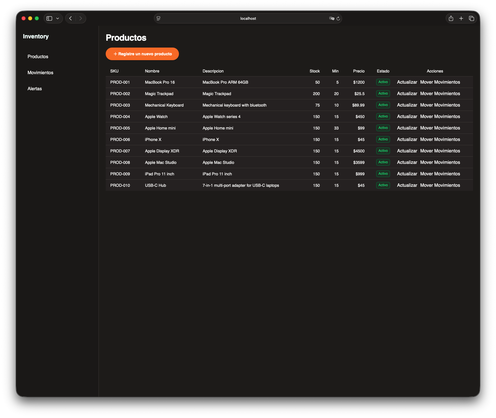
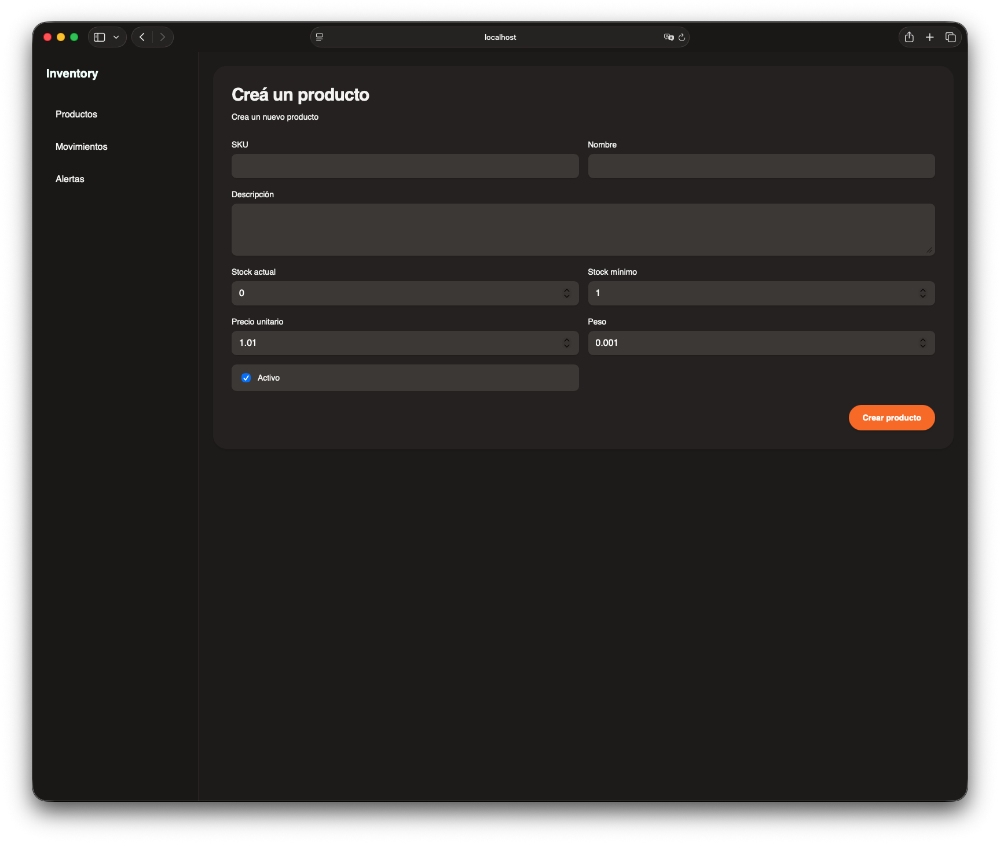
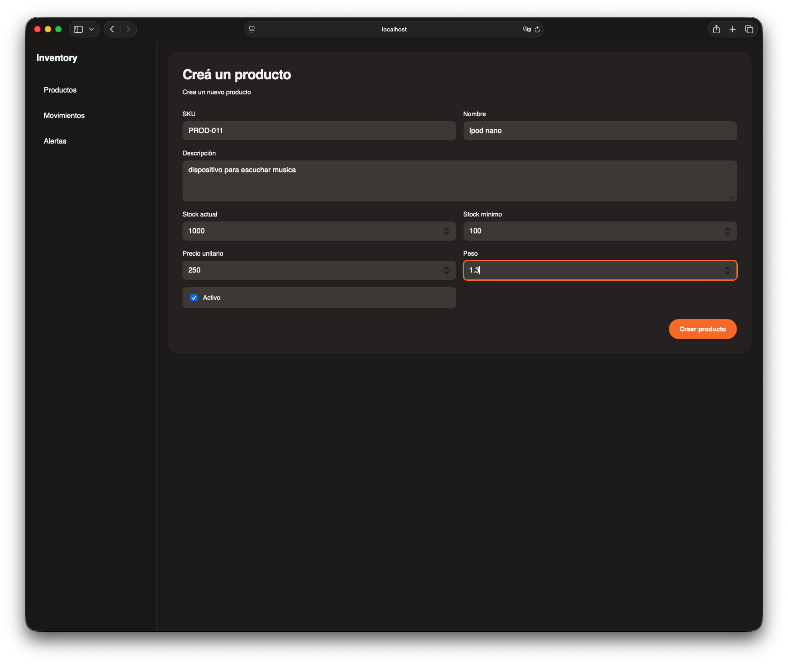
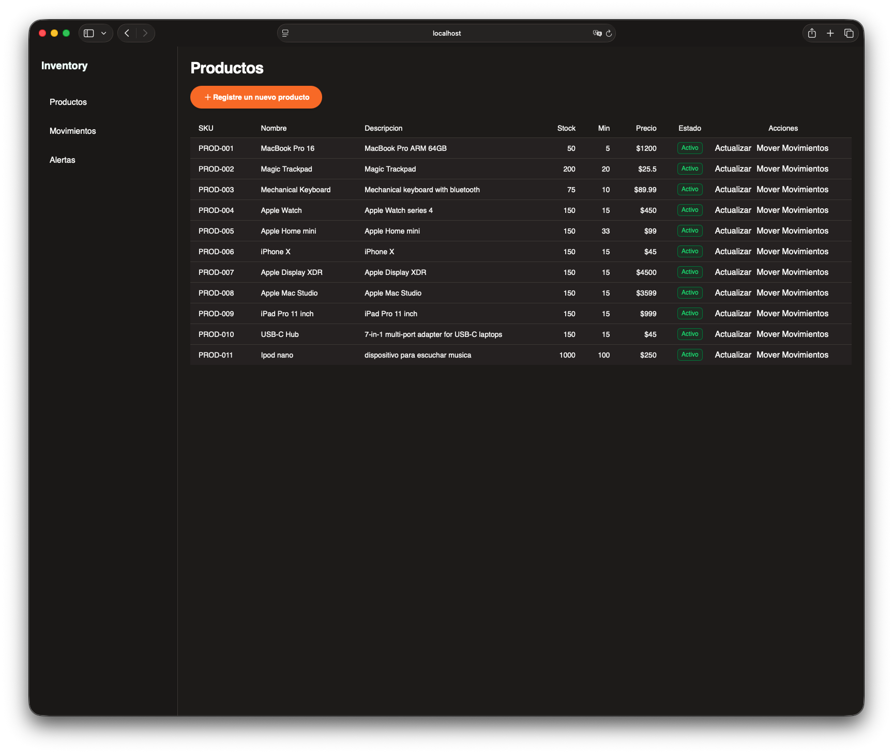
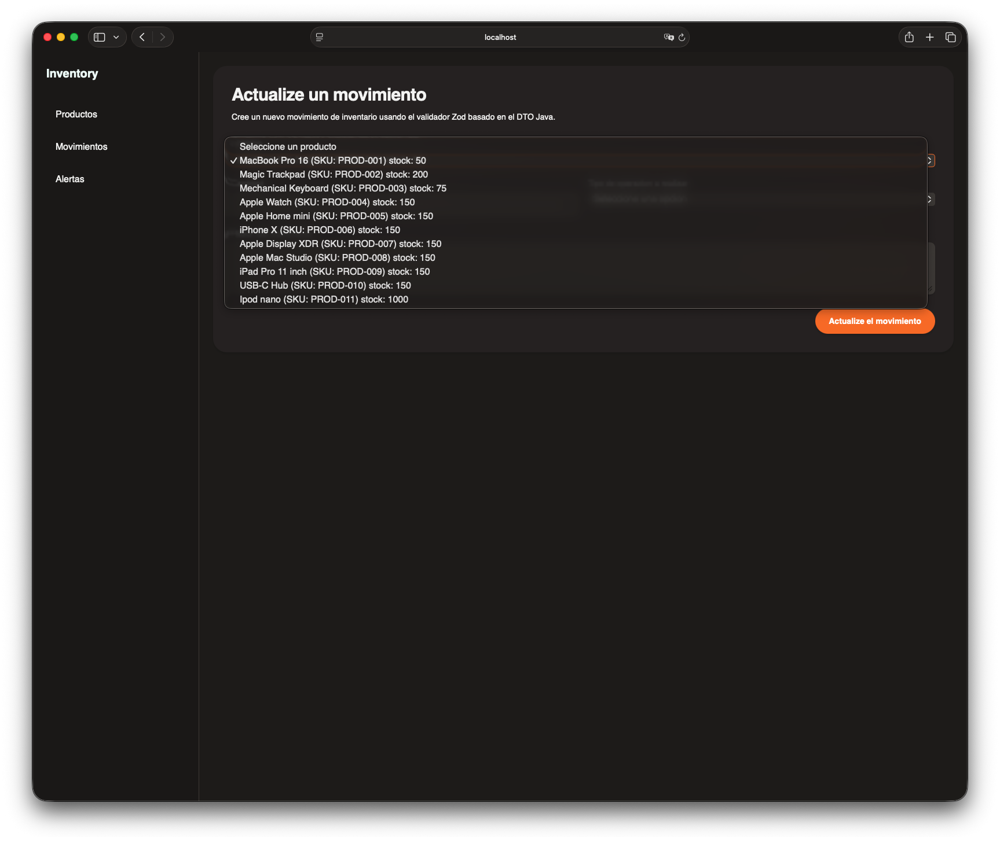
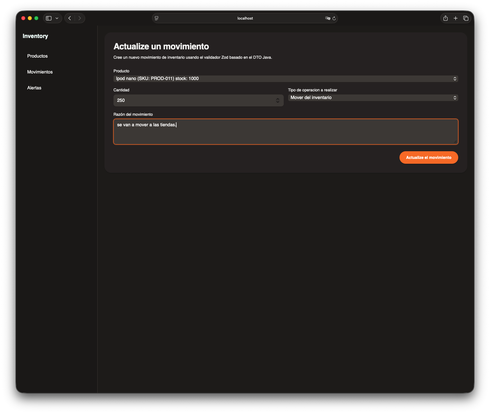
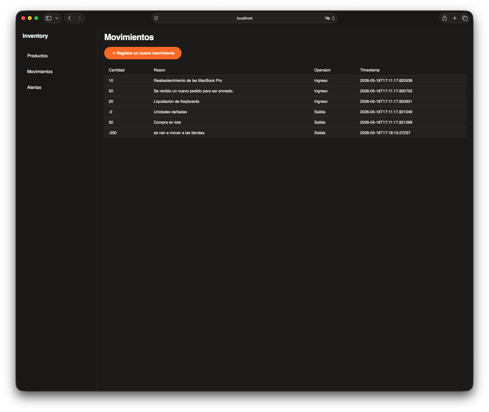
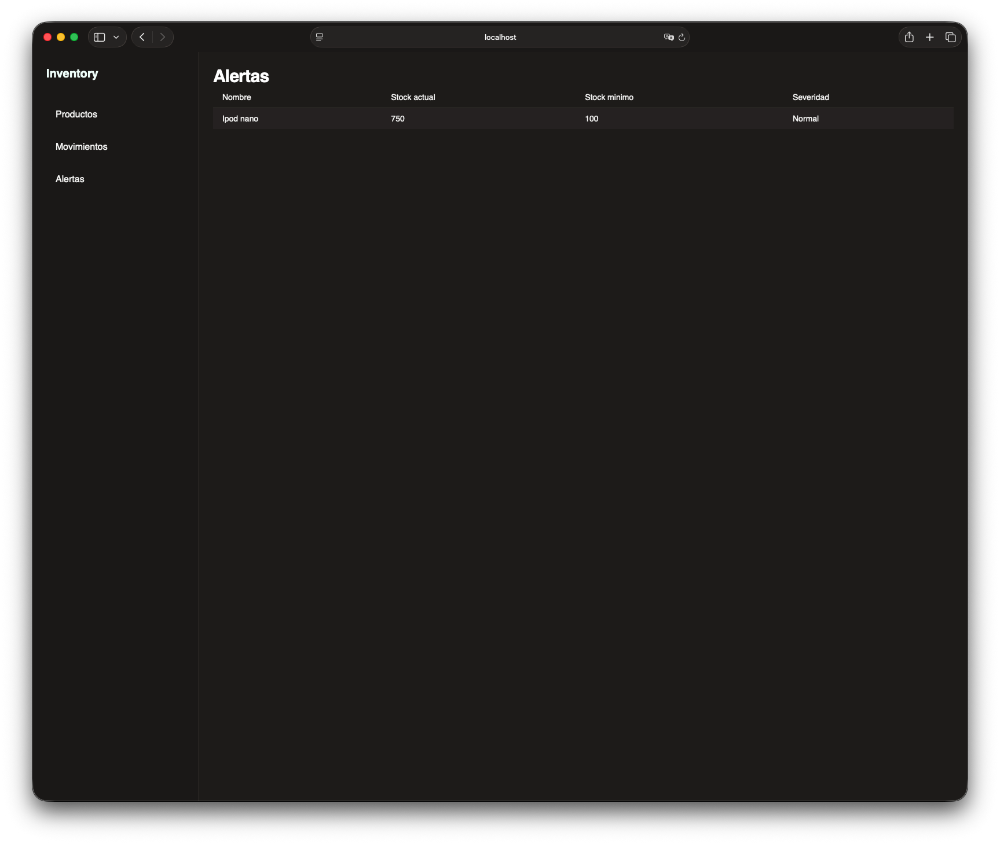
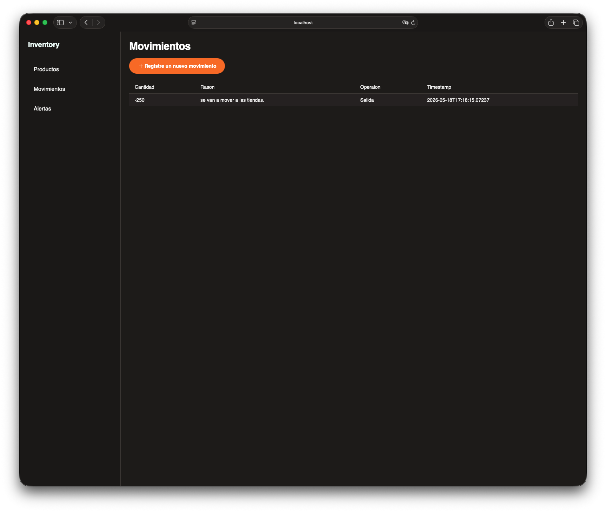
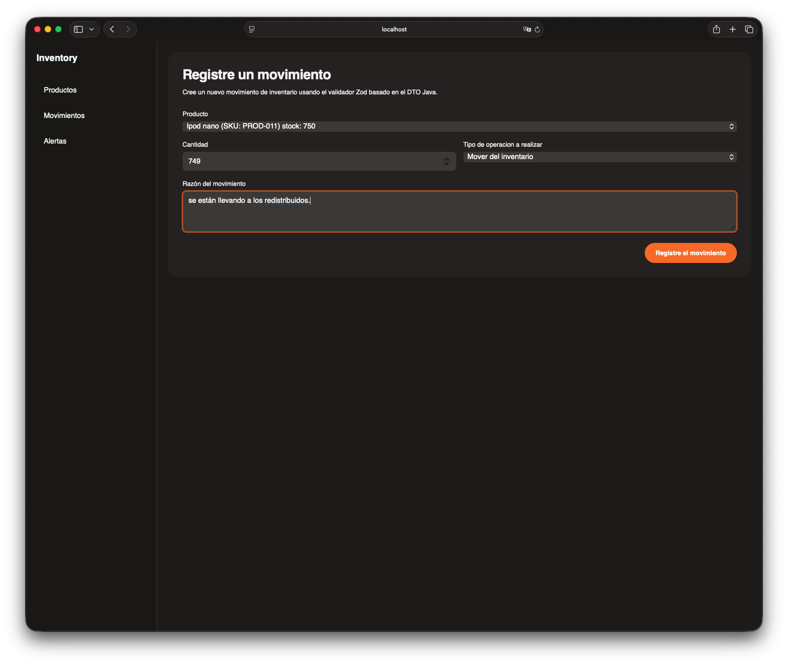

# Prueba tecnica para Banco Cuscatlán


Esta prueba se compone de dos partes el Frontend el cual fue desarrollado en Angular y el Backend el cual se utilizo Spring boot con Java 25


## Construir el jar

```bash
cd /inventory-service
./mvnw clean install -DskipTests
```

```bash
java -jar target/Prueba-tecnica-0.0.1-SNAPSHOT.jar  
```


## se pre-construyo el projecto 
en la raiz del proyecto se encuentra la el jar:
```
java -jar Prueba-tecnica-0.0.1-SNAPSHOT.jar  
```

## Swagger

```
http://localhost:3030/swagger-ui/index.html#/alert-controller/listAlerts
```


## Screenshots:

| Captura | Descripcion |
|------------|-------------|
|  |   |
|  |  |
|  |  |
|  |  |
|  | |
|  | |
|  | |
|  |  |
|  |  |
| | |